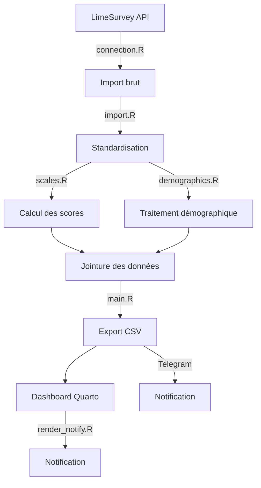
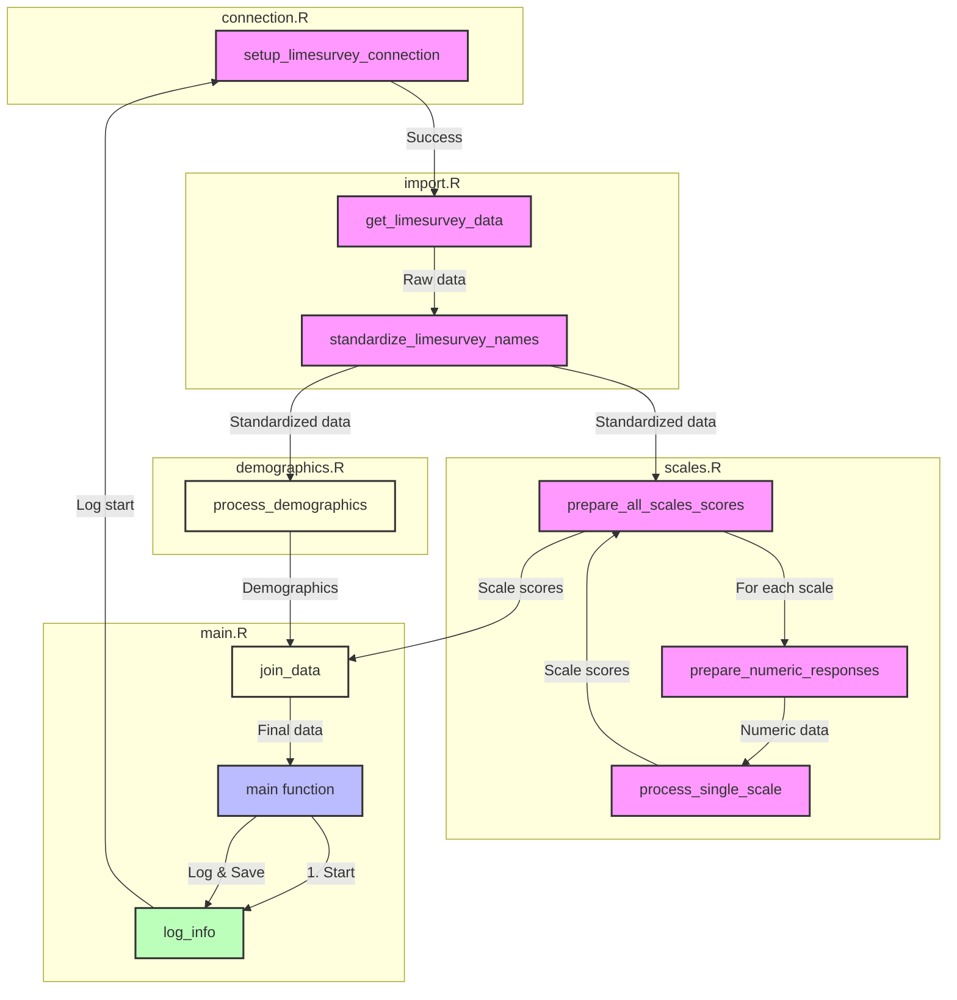

# Plateforme de Suivi du Développement Professionnel

## Vue d'ensemble

Cette plateforme est un outil de monitorage en temps réel du développement professionnel des enseignant·es, basé sur des échelles d'évaluation scientifiquement validées. Le système utilise Quarto pour créer un rapport de résultats pour l'enseignant·e et un rapport de résultats pour la direction permettant différentes analyses selon les besoins.

### Objectifs principaux
- Générer des rapports détaillés sur le développement professionnel
- Informer pour soutenir la prise de décision

### Architecture technique

Le système s'articule autour de trois composants :
1. Une API LimeSurvey pour la collecte des données
2. Un pipeline R pour le traitement et l'analyse
3. Un système de reporting Quarto pour communiquer les résultats

L'architecture est basée sur des fichiers de configuration YAML qui définissent :
- Les credentials d'accès (credentials.yml)
- La structure des échelles d'évaluation (scales.yml)

## Prérequis

### Logiciels
- R (>= 4.2.0)
- RStudio (>= 2023.12.0)
- Quarto (>= 1.4.0)
- Instance LimeSurvey active

### Packages R requis
```r
install.packages(c(
  "tidyverse",  # Traitement des données
  "yaml",       # Lecture des configurations
  "limer",      # API LimeSurvey
  "glue",       # Traitement des données
  "httr",       # Requêtes HTTP (notifications Telegram)
  [packages supplémentaires à ajouter]
))
```

## Structure du projet

```
.
├── archive/                    # Version précédente du dashboard
├── tools/                      # Scripts utilitaires
├── outputs/                    # Fichiers générés
├── src/
│   ├── config/          
│   │   ├── credentials.yml    # Configuration API (non versionné)
│   │   └── scales.yml         # Définition des échelles
│   └── lib/            
├── data/
│   └── processed/             # Données traitées (format CSV)
├── logs/                      # Logs système
├── reporting.qmd              # Fichier Quarto principal
└── README.md
```

## Échelles d'évaluation

- 23 échelles validée scientifiquement
- 65 scores générés

## Configuration

### Credentials

1. Copier le template :
```bash
cp src/config/credentials.yml.template src/config/credentials.yml
```

2. Remplir avec vos accès :
```yaml
limesurvey:
  api_url: 'URL_API_LIMESURVEY'
  username: 'USERNAME'
  password: 'PASSWORD'
  survey_id: 'SURVEY_ID'

telegram:
  bot_token: 'BOT_TOKEN'
  chat_id: 'CHAT_ID'

researcher_codes:
  - 'CODE1'
  - 'CODE2'
```
## Pipeline de traitement

### Flux principal



### Notifications Telegram

Le système intègre des notifications Telegram à deux niveaux :

1. **Pipeline de données (main.R)**
   - Notification du statut d'exécution
   - Nombre d'observations traitées
   - Temps d'exécution
   - Messages d'erreur éventuels

2. **Rendu du dashboard (render_notify.R)**
   - Notification du succès/échec du rendu Quarto
   - Redémarrage automatique du serveur Shiny sur Linux

#### Configuration Telegram
1. Créer un bot via @BotFather sur Telegram
2. Récupérer le token du bot
3. Créer un canal et y ajouter le bot
4. Configurer le chat_id dans credentials.yml

### Détails du process



#### Mise à jour des données

Les données sont mises à jour automatiquement 3 fois par jour via cronjob sur le serveur qui accueille l'application. L'heure de dernière mise à jour est affichée dans l'interface du dashboard. Chaque mise à jour déclenche :

1. Exécution de main.R
   - Collection et traitement des données
   - Export des fichiers CSV
   - Notification Telegram du statut

2. Exécution de render_notify.R
   - Rendu du dashboard Quarto
   - Redémarrage du serveur Shiny si nécessaire
   - Notification Telegram du statut

Le statut de ces opérations peut être suivi via :
- Les logs dans /logs/process.log
- Les notifications Telegram
- L'interface du dashboard

## Génération de rapports

[à venir]

## Support

Pour toute question technique :
1. Consulter les logs dans /logs/process.log
2. Vérifier la configuration dans /src/config
3. Contacter l'équipe chic et choc de développement

## Licence

Ce projet est sous licence Creative Commons Attribution 4.0 International (CC BY 4.0).