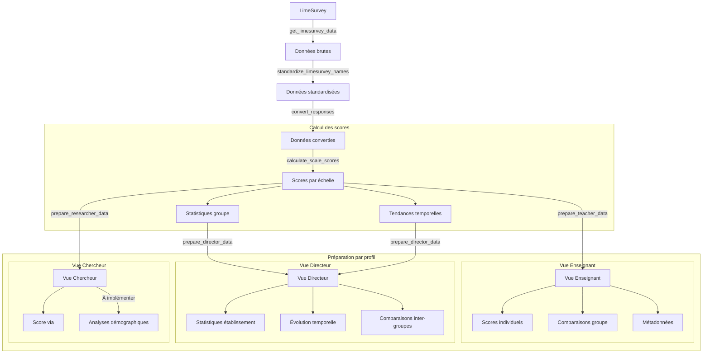

# Plateforme d'évaluation du développement professionnel

## Vue d'ensemble

Cette plateforme est un outil de récolte et d'analyse de données pour les établissements scolaires, permettant un monitorage en temps réel du développement professionnel à travers différentes échelles d'évaluation.

### Objectifs principaux
- Fournir aux directions d'établissement un tableau de bord interactif pour le pilotage
- Permettre la récolte standardisée de données via des questionnaires validés scientifiquement
- Offrir différentes vues des données selon le profil utilisateur (enseignant, directeur, chercheur)

### Architecture globale
La plateforme s'articule autour de trois composants principaux :
1. Un backend LimeSurvey pour la récolte des données
2. Un système de traitement R pour l'analyse et le scoring
3. Une interface Shiny hébergée sur un serveur virtuel Ubuntu pour la visualisation des données

Le système est conçu pour être extensible, avec une architecture basée sur des fichiers de configuration YAML qui permettent l'ajout simple de nouvelles échelles d'évaluation et la gestion sécurisée des credentials.

## Installation et Configuration

### Prérequis
- R (>= 4.2.0)
- RStudio (recommandé pour le développement)
- Instance LimeSurvey active
- Packages R requis :
  - shiny
  - bslib
  - tidyverse
  - lubridate
  - yaml
  - limer

### Configuration des credentials

1. Dans le dossier `config/`, copiez le template des credentials :
```bash
cp credentials.yml.template credentials.yml
```

2. Modifiez `credentials.yml` avec vos informations de connexion :
```yaml
limesurvey:
  api_url: 'URL_DE_VOTRE_LIMESURVEY'
  username: 'VOTRE_USERNAME'
  password: 'VOTRE_PASSWORD'

researcher_codes:
  - 'CODE_CHERCHEUR_1'
  - 'CODE_CHERCHEUR_2'
```

**Important** : Ne committez jamais le fichier `credentials.yml` - il est déjà inclus dans le `.gitignore`.

### Gestion des dépendances avec {renv}

Ce projet utilise {renv} pour gérer les dépendances R. {renv} crée un environnement isolé pour le projet, garantissant la reproductibilité des analyses.

1. Installation initiale :
```R
install.packages("renv")
renv::restore()
```

2. Ajout d'un nouveau package :
```R
renv::install("nom_du_package")
```

3. Mise à jour du fichier de verrouillage :
```R
renv::snapshot()
```

### Structure du projet
```
.
├── R/
│   ├── core/                    # Fonctions fondamentales de traitement
│   │   ├── analysis.R          # Analyses statistiques
│   │   ├── config.R            # Configuration et connexion
│   │   └── data_processing.R   # Import et traitement des données
│   ├── dashboard/              # Interface et logique métier
│   │   ├── functions.R         # Préparation des données par profil
│   │   ├── server/            # Logique serveur par profil
│   │   └── ui/               # Interfaces utilisateur par profil
│   └── functions.R            # Point d'entrée des fonctions
├── app.R                      # Application Shiny principale
├── global.R                   # Configuration globale et chargement
└── config/
    ├── credentials.yml        # Identifiants (non versionné)
    └── scales_definition.yml  # Configuration des échelles
```

### Configuration des échelles

Le fichier `config/scales_definition.yml` définit la structure des échelles et leur scoring. Pour ajouter une nouvelle échelle :

1. **Définition dans LimeSurvey**
   - Créez les questions
   - Notez les identifiants

2. **Configuration YAML**
```yaml
scales:
  votre_echelle:
    id: "group_id"
    type: "likert_5"
    response_prefix: "AO0"
    items:
      - id: "question_id_1"
        reversed: false
```

3. **Validation**
   - Vérifiez le format YAML
   - Testez avec les données de test
   - Validez le scoring

### Vérification de l'installation

Lancez les tests pour vérifier la configuration :
```R
source("tests/tests.R")
```

## Utilisation

### Lancement de l'application
```R
shiny::runApp()
```

### Profils utilisateurs

#### Enseignants
- Visualisation des scores individuels
- Comparaison avec les moyennes du groupe
- Suivi temporel

#### Directeurs
- Vue d'ensemble de l'établissement
- Tableaux de bord agrégés
- Comparaison avec les indices globaux

#### Chercheurs
- Accès aux données anonymisées
- Analyses statistiques avancées
- Filtrage démographique

## Développement

### Bonnes pratiques
- Documentez toute nouvelle échelle
- Testez avec les données de test
- Ne committez jamais de credentials
- Utilisez les branches pour les nouvelles fonctionnalités

### Pipeline de traitement



### Initialisation et configuration

Le système s'initialise via global.R qui assure trois fonctions essentielles :
1. Chargement des packages nécessaires (shiny, bslib, tidyverse, lubridate, yaml, limer)
2. Lecture de la configuration des échelles depuis scales_definition.yml
3. Chargement de toutes les fonctions via R/functions.R

### Flux de traitement des données

Notre pipeline de traitement des données suit une architecture en couches, avec des transformations successives des données brutes jusqu'aux visualisations spécifiques par profil.

#### 1. Connexion et import (R/core/config.R)

La fonction `setup_limesurvey_connection()` initialise la connexion à LimeSurvey en :
- Chargeant les credentials depuis le fichier YAML
- Configurant les options de connexion à l'API
- Testant la connexion via `get_session_key()`

#### 2. Traitement des données (R/core/data_processing.R)

Le traitement s'effectue en plusieurs étapes :

**Import des données**
`get_limesurvey_data(survey_id, config)` :
- Récupère les réponses brutes via l'API LimeSurvey
- Gère l'encodage des caractères
- Effectue une première validation des données

**Standardisation**
`standardize_limesurvey_names(data, config)` :
- Nettoie les noms de colonnes
- Supprime les points dans les noms
- Convertit en minuscules
- Gère les codes de groupe manquants

**Conversion des réponses**
`convert_responses(data, config)` :
- Convertit les réponses codées en valeurs numériques
- Traite les données démographiques
- Applique les configurations spécifiques à chaque échelle

**Calcul des scores**
`calculate_scale_scores(data, scale_name, config)` :
- Valide la présence des items requis
- Gère les valeurs manquantes
- Calcule les scores totaux et sous-scores selon la configuration
- Vérifie les taux de réponse minimums

#### 3. Analyses statistiques (R/core/analysis.R)

Trois types d'analyses sont disponibles :

`analyze_group_scores(scores)` :
- Calcule les statistiques descriptives par groupe
- Fournit n, moyenne, écart-type, min, max pour chaque variable numérique

`analyze_temporal_trend(scores, period)` :
- Analyse l'évolution temporelle des scores
- Agrège les données par période spécifiée
- Calcule les statistiques temporelles

`identify_repeated_measures(scores)` :
- Identifie les mesures répétées par individu
- Calcule les intervalles entre mesures
- Fournit des métriques de suivi longitudinal

#### 4. Préparation des vues (R/dashboard/functions.R)

Les données sont ensuite adaptées pour chaque profil utilisateur :

**Vue Enseignant** (`prepare_teacher_data()`)
- Entrée : données converties, ID personnel, configuration
- Validation de l'ID et récupération des données individuelles
- Calcul des scores personnels via `calculate_scale_scores()`
- Ajout des moyennes de groupe pour comparaison
- Sortie : scores individuels, comparatifs et métadonnées

**Vue Directeur** (`prepare_director_data()`)
- Entrée : données converties, code groupe, configuration
- Validation du code groupe
- Calcul des statistiques globales et par groupe
- Analyse des tendances temporelles
- Sortie : vue d'ensemble de l'établissement avec comparaisons

**Vue Chercheur** (`prepare_researcher_data()`)
- Entrée : données converties, configuration, filtres démographiques
- Application des filtres démographiques
- Calcul des scores agrégés
- Sortie : données de recherche anonymisées
Note : Cette vue est en développement.

### Interface utilisateur

Pour chaque profil, une interface spécifique (R/dashboard/ui/) gère l'affichage des données, tandis que la logique associée (R/dashboard/server/) gère les interactions et les mises à jour dynamiques.

#### Configuration globale (global.R)

global.R établit l'environnement de base de l'application. Il initialise les éléments fondamentaux nécessaires au fonctionnement de l'interface :

- Chargement des packages essentiels (shiny, bslib, tidyverse, lubridate, yaml, limer)
- Lecture de la configuration des échelles depuis scales_definition.yml
- Import des fonctions via functions.R qui agrège l'ensemble des fichiers de fonctions du projet

Cette configuration globale est chargée une seule fois au démarrage de l'application et reste disponible pour tous les composants.

#### Point d'entrée (app.R)

app.R orchestre l'ensemble de l'application. Il définit deux éléments majeurs :

La fonction ui principale qui :
- Établit le thème visuel via bslib
- Crée l'en-tête de l'application
- Met en place un système de navigation latérale avec sélection du profil utilisateur
- Gère l'affichage conditionnel des interfaces spécifiques à chaque profil

La fonction server qui :
- Maintient l'état global de l'application via reactiveValues
- Gère la validation des identifiants utilisateur
- Coordonne le chargement et la préparation des données
- Dispatche vers les modules serveur appropriés selon le profil

#### Interfaces spécifiques (R/dashboard/ui/)

Chaque profil utilisateur dispose de son interface dédiée :

teacher_ui.R crée une interface focalisée sur :
- La sélection des échelles d'évaluation
- L'affichage des scores personnels
- La visualisation des comparaisons avec le groupe

director_ui.R propose une interface orientée pilotage avec :
- La sélection des échelles et des scores à analyser
- L'affichage des statistiques d'établissement
- La visualisation des évolutions temporelles

researcher_ui.R fournit une interface analytique permettant :
- Le filtrage des données selon des critères démographiques
- La visualisation des données agrégées
- L'accès aux analyses statistiques

#### Logique métier (R/dashboard/server/)

Les fichiers server correspondants implémentent la logique spécifique à chaque profil :

teacher_server.R gère :
- La préparation des données personnelles via prepare_teacher_data()
- La mise à jour réactive des visualisations
- Les calculs de comparaison avec le groupe

director_server.R s'occupe de :
- L'agrégation des données d'établissement via prepare_director_data()
- La génération des statistiques de groupe
- La création des graphiques d'évolution

researcher_server.R prend en charge :
- Le traitement des filtres démographiques
- La préparation des données de recherche via prepare_researcher_data()
- La génération des visualisations statistiques

Cette architecture modulaire permet un découpage clair des responsabilités tout en maintenant un flux de données cohérent, de l'import initial jusqu'à la visualisation finale. Le système reste extensible, permettant l'ajout de nouveaux profils ou fonctionnalités sans perturber l'existant.

## Contact et Support

Pour toute question ou problème :
- Consultez la documentation dans le readme.md
- Soumettez une issue sur GitHub
- Contactez l'équipe de développement

## Licence

Ce projet est sous licence Creative Commons Attribution 4.0 International (CC BY 4.0).