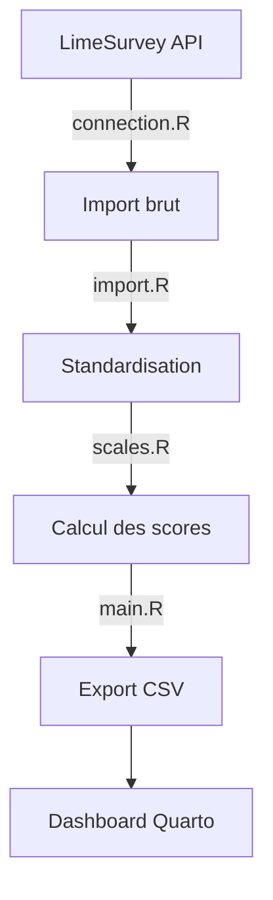
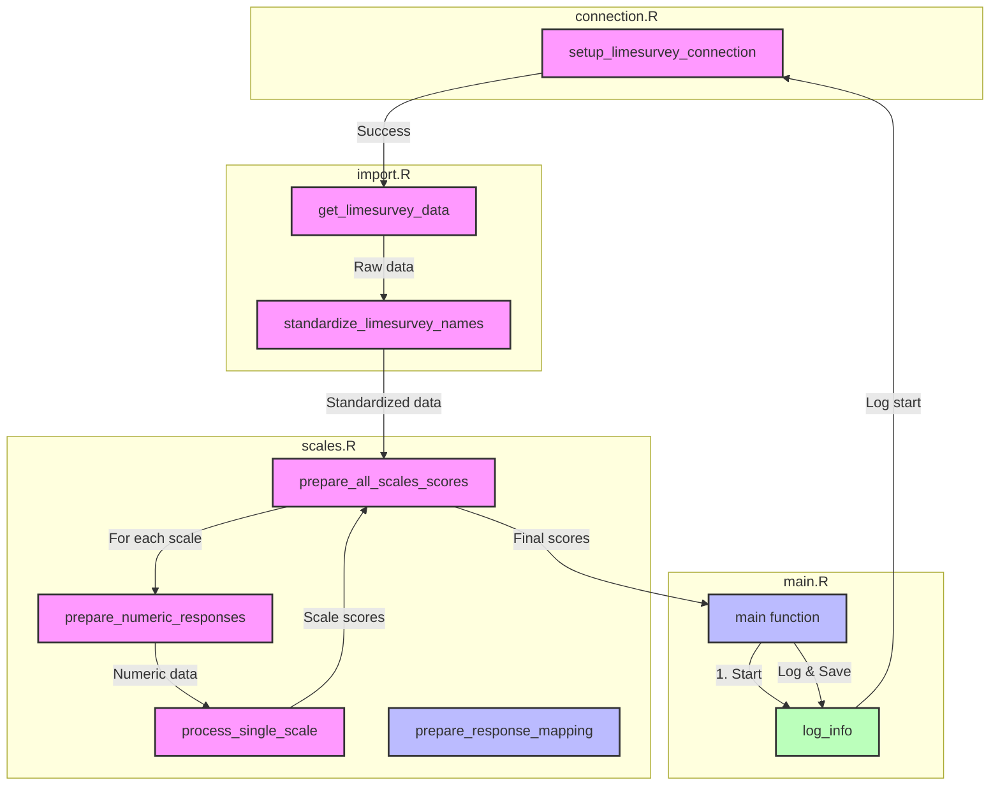

# Plateforme de Suivi du Développement Professionnel

## Vue d'ensemble

Cette plateforme est un outil de monitorage en temps réel du développement professionnel des enseignants, basé sur des échelles d'évaluation scientifiquement validées. Le système utilise Quarto et Shiny pour créer un dashboard interactif permettant différentes vues selon le profil utilisateur.

### Objectifs principaux
- Permettre aux enseignants de suivre leur développement professionnel
- Fournir aux directions un tableau de bord pour le pilotage d'établissement
- Offrir aux chercheurs un accès aux données pour des analyses approfondies

### Architecture technique

Le système s'articule autour de trois composants :
1. Une API LimeSurvey pour la collecte des données
2. Un pipeline R pour le traitement et l'analyse
3. Un dashboard Quarto avec des composants Shiny pour la visualisation

L'architecture est basée sur des fichiers de configuration YAML qui définissent :
- Les credentials d'accès (credentials.yml)
- La structure des échelles d'évaluation (scales.yml)

## Prérequis

### Logiciels
- R (>= 4.2.0)
- RStudio (>= 2023.12.0)
- Quarto (>= 1.4.0)
- Instance LimeSurvey active

### Packages R requis
```r
install.packages(c(
  "tidyverse",  # Traitement des données
  "shiny",      # Composants interactifs
  "bslib",      # Theming Bootstrap
  "bsicons",    # Icônes Bootstrap
  "plotly",     # Graphiques interactifs
  "DT",         # Tables interactives
  "yaml",       # Lecture des configurations
  "limer"       # API LimeSurvey
  "glue"        # Traitement des données
))
```

## Structure du projet

```
.
├── dashboard_files/      # Fichiers générés par Quarto
├── src/
│   ├── config/          
│   │   ├── credentials.yml    # Configuration API (non versionné)
│   │   └── scales.yml        # Définition des échelles
│   └── lib/            
│       ├── connection.R      # Connexion LimeSurvey
│       ├── import.R         # Import des données
│       ├── scales.R        # Traitement des échelles
│       └── main.R         # Pipeline principal
├── data/
│   └── processed/       # Données traitées
├── logs/                # Logs système
├── dashboard.qmd        # Dashboard Quarto principal
└── README.md
```

## Configuration

### Credentials

1. Copier le template :
```bash
cp src/config/credentials.yml.template src/config/credentials.yml
```

2. Remplir avec vos accès :
```yaml
limesurvey:
  api_url: 'URL_API_LIMESURVEY'
  username: 'USERNAME'
  password: 'PASSWORD'
  survey_id: 'SURVEY_ID'

researcher_codes:
  - 'CODE1'
  - 'CODE2'
```

### Échelles d'évaluation

Le système gère actuellement 5 échelles standardisées :

1. **TSES (Teacher Self-Efficacy Scale)**
   - Score total et 3 sous-échelles
   - Échelle Likert 9 points

2. **TES (Teacher Emotion Scale)**
   - 3 sous-échelles : joie, colère, anxiété
   - Échelle Likert 4 points

3. **SMBM (Shirom-Melamed Burnout Measure)**
   - Score total et 3 sous-échelles
   - Échelle Likert 7 points

4. **CPS (Compétences Psychosociales)**
   - Score total et 4 sous-échelles
   - Échelle Likert 7 points

5. **TWBI (Teacher Wellbeing Index)**
   - Score total et 5 sous-échelles
   - Échelle Likert 6 points

## Pipeline de traitement

### Import/Préparation des données



Le pipeline est exécuté via src/lib/main.R qui :
1. Configure la connexion API
2. Importe et standardise les données
3. Calcule les scores par échelle
4. Exporte les résultats datés

### Détails du process



### Mise à jour des données

Les données sont mises à jour automatiquement 3 fois par jour via cronjob sur le serveur qui accueille l'application. L'heure de dernière mise à jour est affichée dans l'interface du dashboard.

## Dashboard Quarto

### Lancement

```bash
quarto render dashboard.qmd
```

### Profils utilisateurs

#### Espace profs
- Visualisation des scores personnels
- Comparaison avec moyennes de groupe
- Sélection des échelles et sous-scores

#### Espace direction
- Vue d'ensemble de l'établissement
- Statistiques agrégées par groupe
- Évolution temporelle des scores

#### Espace recherche
- En développement
- Accès prévu aux données anonymisées
- Filtres démographiques

### Paramètres de visualisation

Chaque vue propose :
- Sélection des échelles
- Choix des sous-scores
- Affichage graphique ou tabulaire
- Périodes temporelles

## Développement

### Bonnes pratiques
- Documenter les modifications d'échelles dans scales.yml
- Tester avec un jeu de données réduit
- Ne pas versionner credentials.yml
- Loguer les erreurs dans /logs

### Extensions futures
- Ajout de nouvelles échelles
- Analyses démographiques 
- Export de rapports PDF
- Tableaux de bord personnalisés

## Support

Pour toute question technique :
1. Consulter les logs dans /logs/process.log
2. Vérifier la configuration dans /src/config
3. Contacter l'équipe de développement

## Licence

Ce projet est sous licence Creative Commons Attribution 4.0 International (CC BY 4.0).